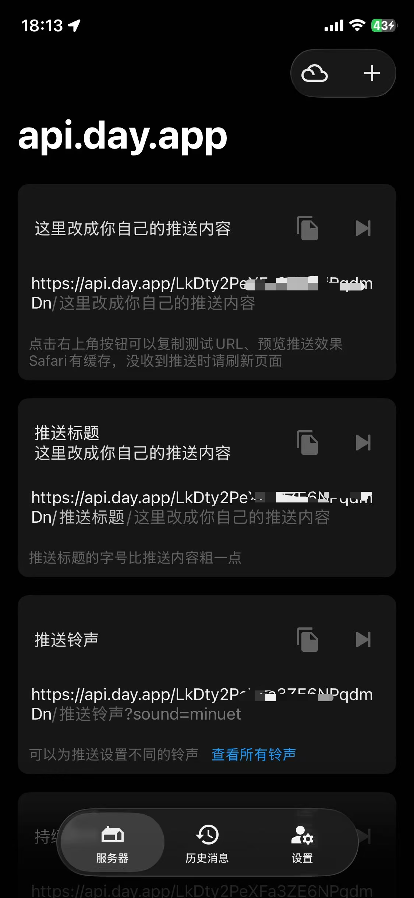
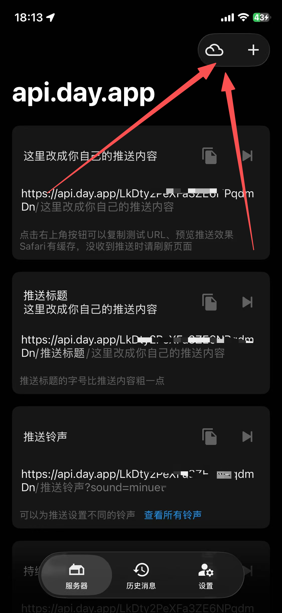
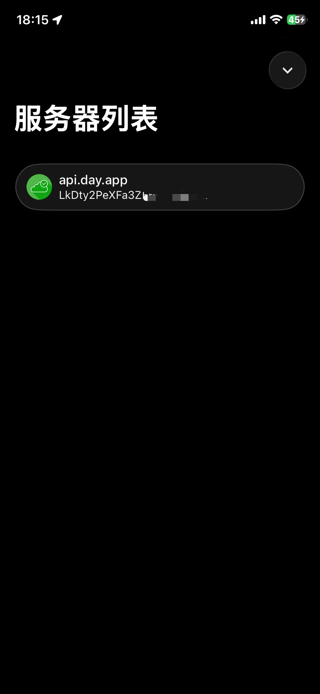
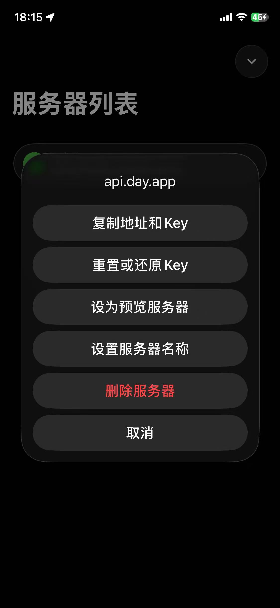
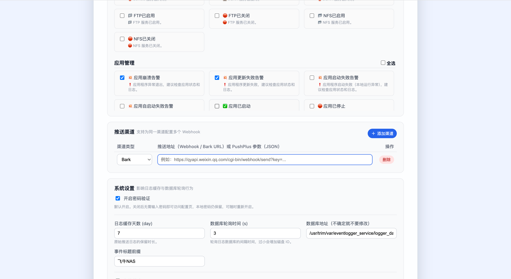

# Bark

[← 推送渠道总览](../notification-channels.md) · [← README](../../README.md)

> 以下内容留空，由你自行补充。
首先在APP store下载Bark

然后打开后你就能获取到你的Bark url

如果你想方便快捷的使用
点击右上角icon

点击服务器列表

复制地址和Key，讲复制的url直接添加的项目里面，渠道选择Bark

如果你想自定义样式，比如标题，比如icon
获取url类似，如果你熟悉Bark，那么你就知道从哪里一键复制，复制后，需要讲内容替换成{content}，项目会匹配处理{content}标记。
比如你要自定义标题：
https://api.day.app/LkDty2key/这是我的标题/{content}

比如你想自定义icon
https://api.day.app/LkDty2key/{content}?icon=https://day.app/assets/images/avatar.jpg

## 捐赠

创作不易，为了项目的稳定和可持续发展，欢迎大家捐赠支持
<table>
  <tr>
    <td></td>
    <td></td>
  </tr>
</table>
