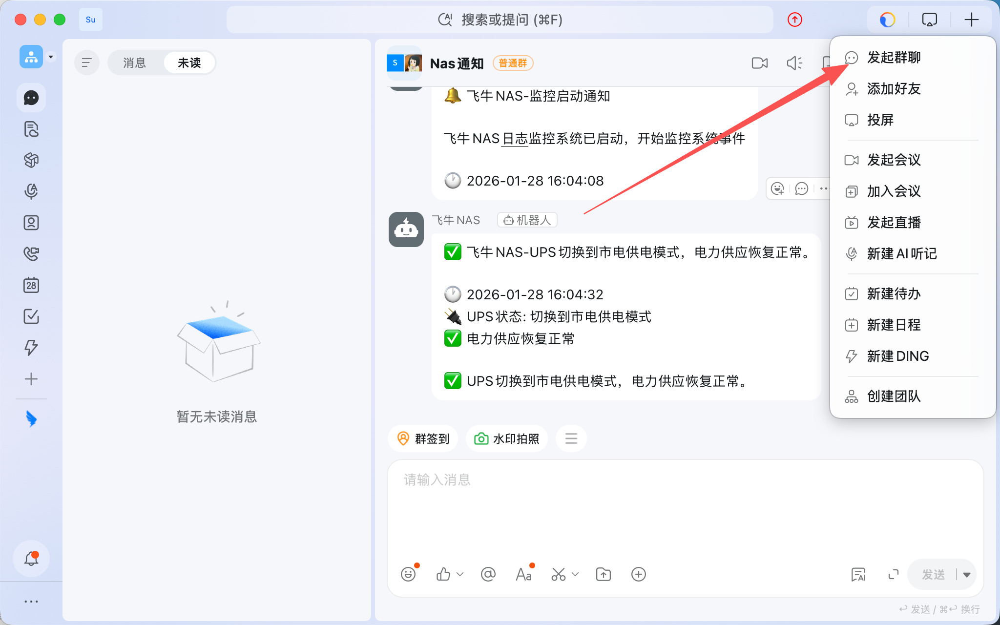
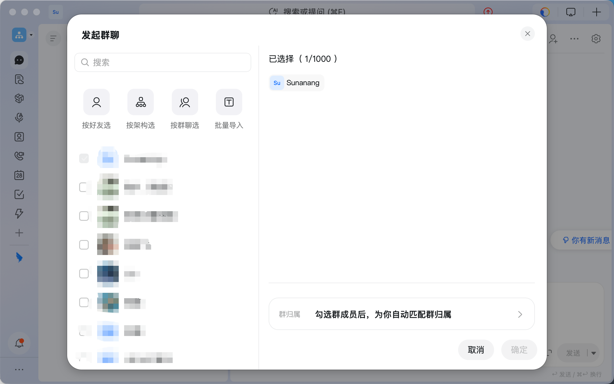
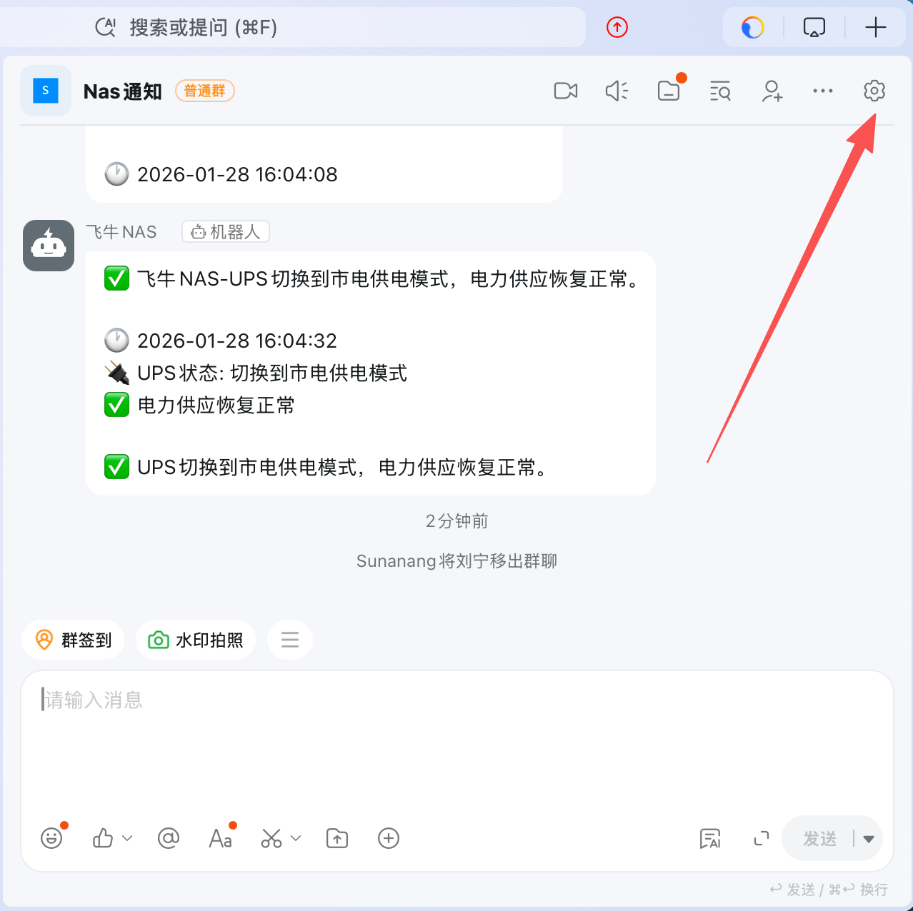
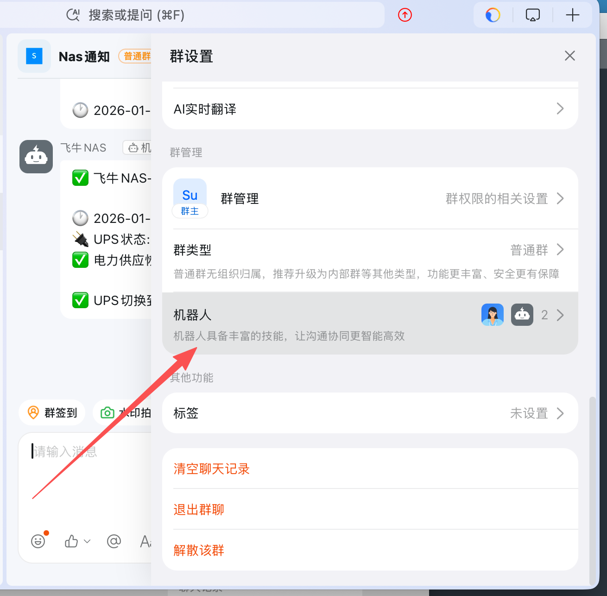
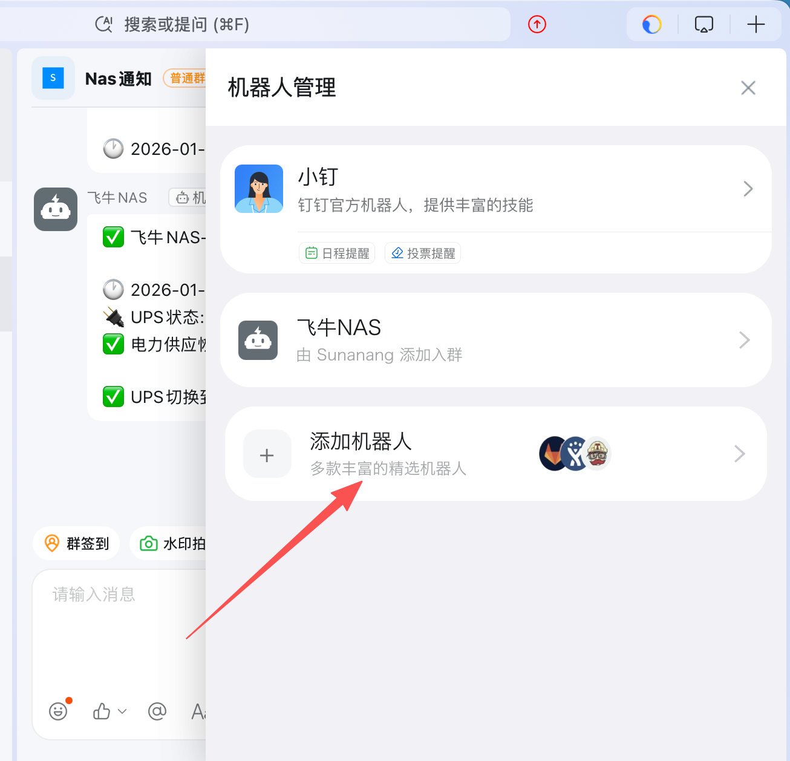
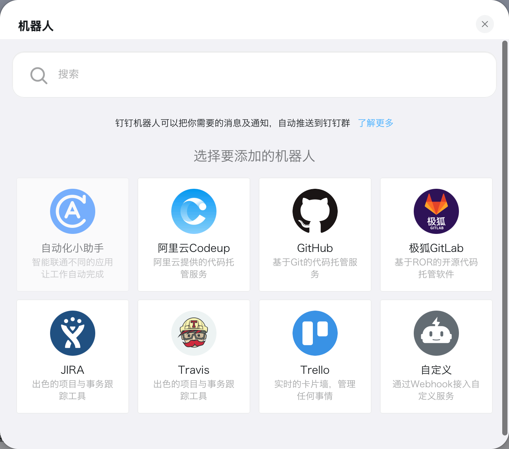
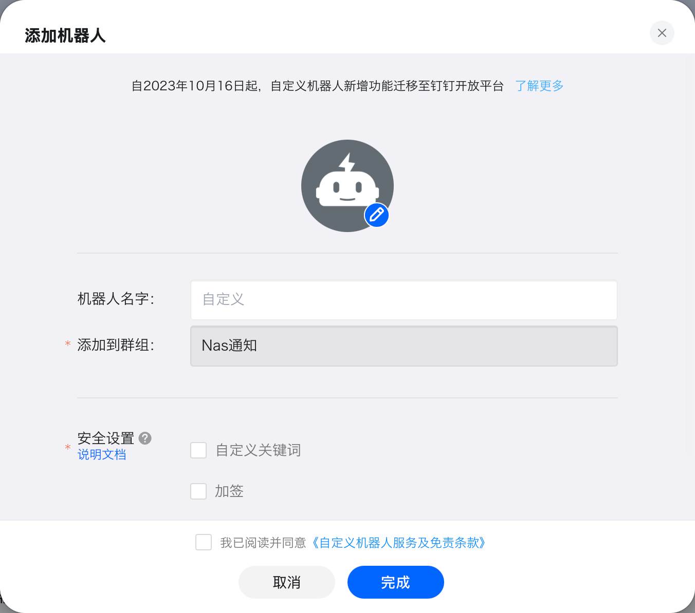
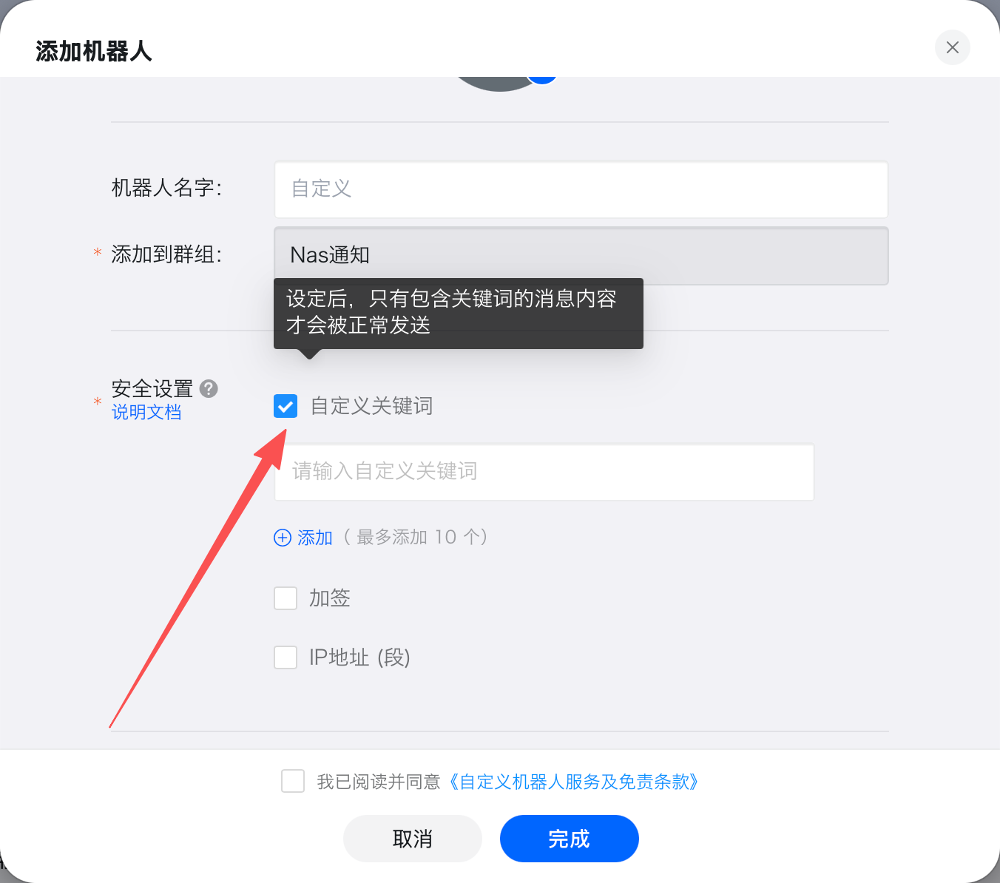
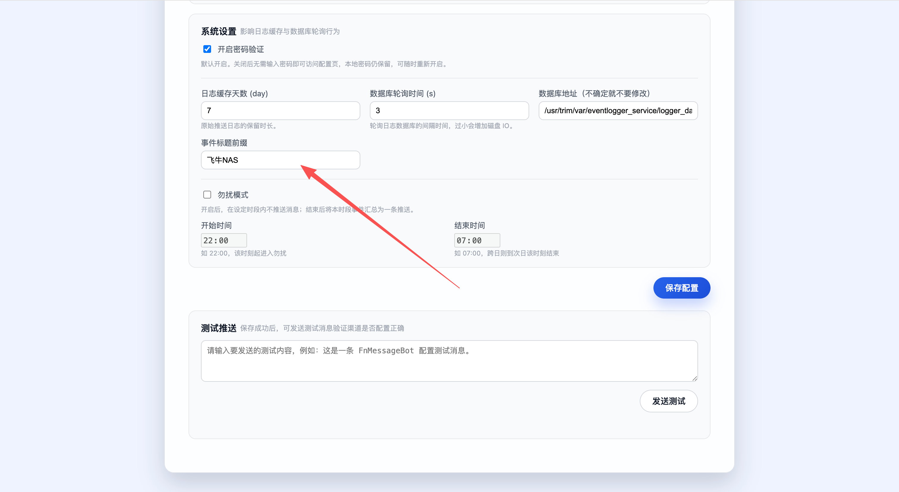
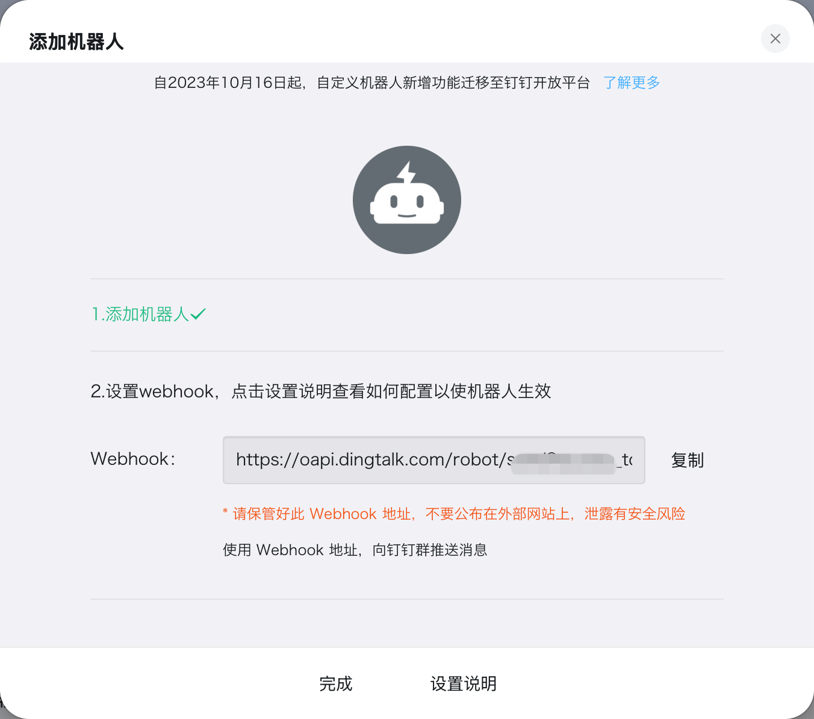

# 钉钉（群机器人 Webhook）

[← 推送渠道总览](../notification-channels.md) · [← README](../../README.md)

> 以下内容留空，由你自行补充。
首先登录钉钉个人账号
然后新建群聊

钉钉群创建的时候最少需要两个人，所以你需要再拉一个人才可以

创建成功后，你可以从群里删除其他人

然后点击设置

向下滑可以看到一个机器人

点击添加机器人，选择自定义

然后点击添加

这个时候你可以设置机器人的名称
在安全设置里面一定要选择 自定义关键字

可以看到这里需要输入一个内容，这个内容是什么呢？其实项目已经预留了功能

正是项目打开后的页面，滑动到最下面，可以看到“事件标题前缀”，自定义关键字一定要和这个保持一致，否则无法接受到消息
自定义关键字添加完成后，点击完成，就能获取到webHook了

## 捐赠

创作不易，为了项目的稳定和可持续发展，欢迎大家捐赠支持
<table>
  <tr>
    <td></td>
    <td></td>
  </tr>
</table>
