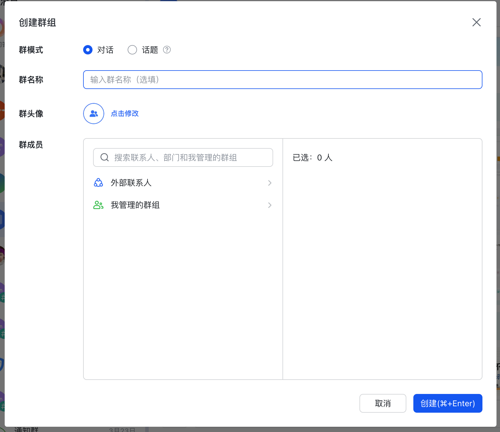
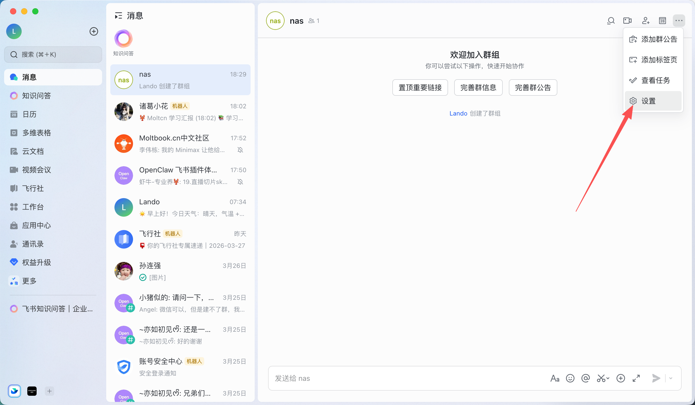
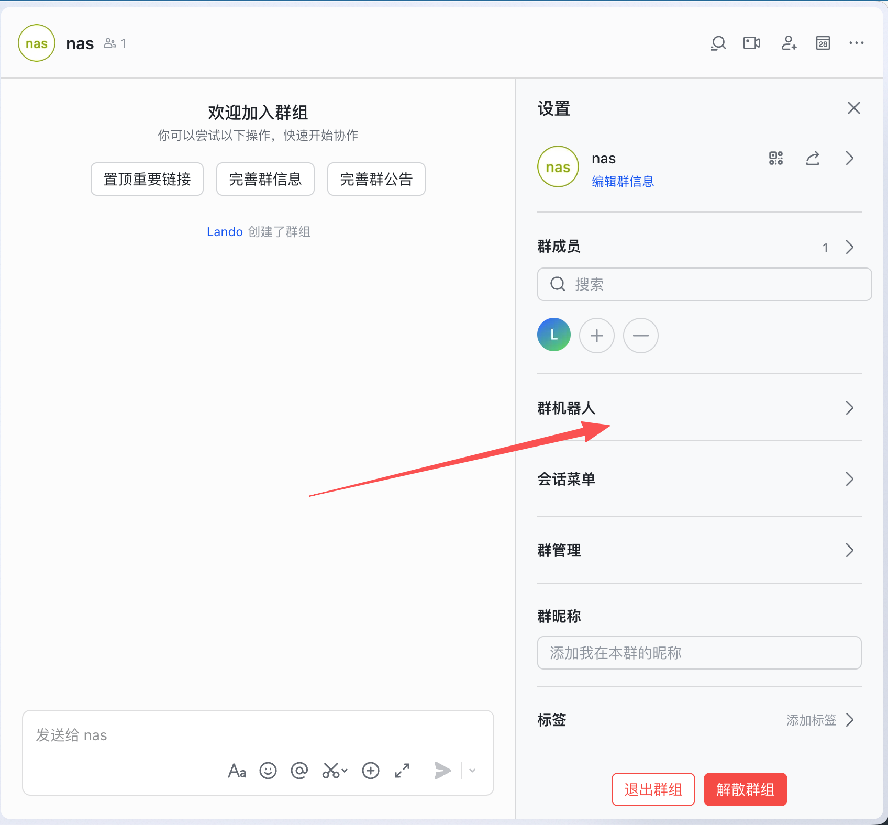
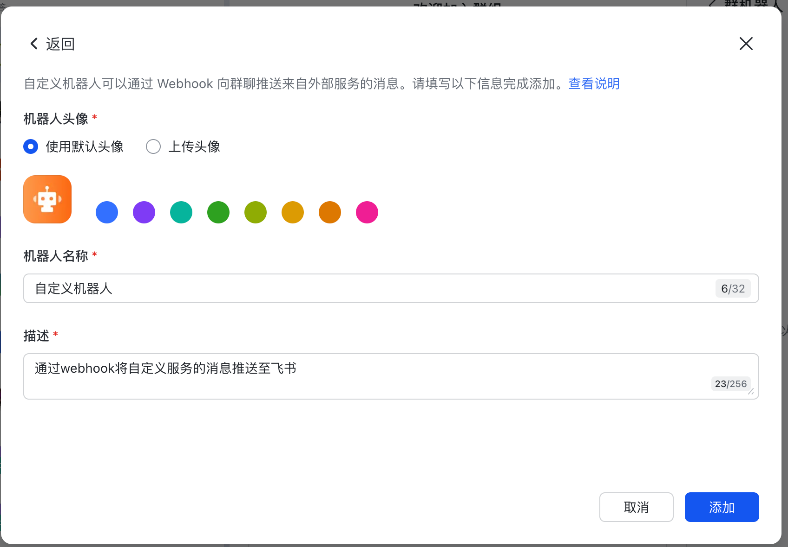
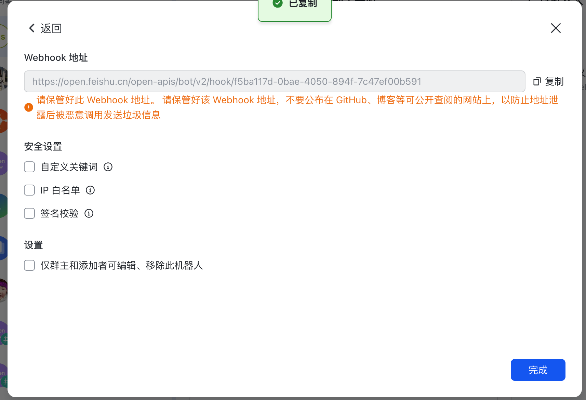
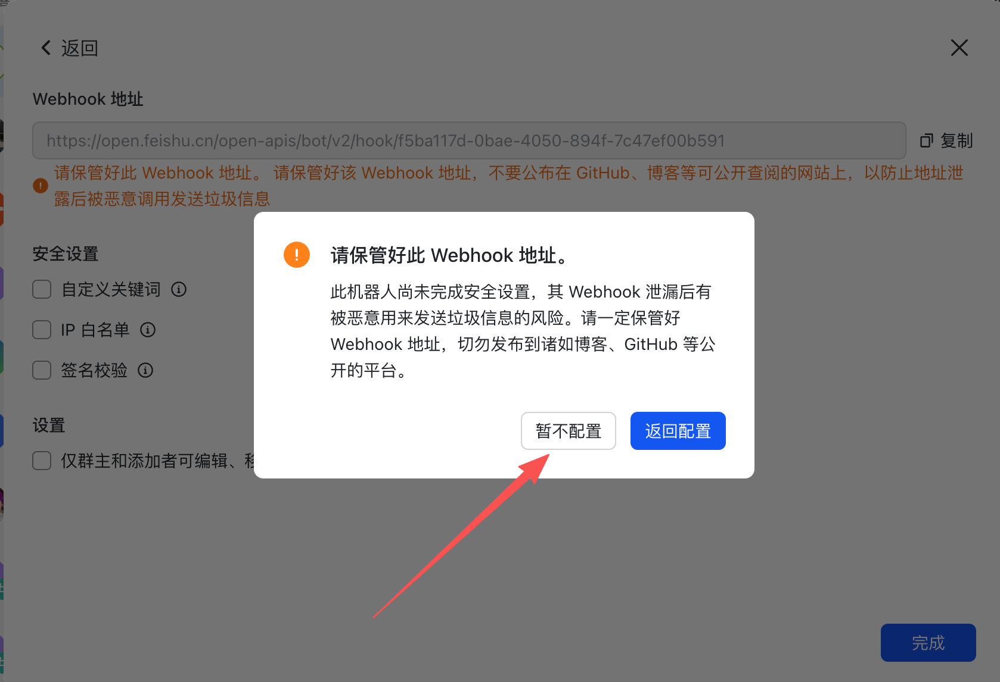
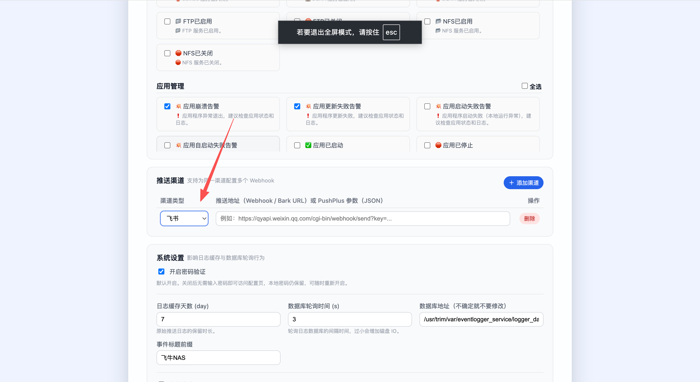

# 飞书（群机器人 Webhook）

[← 推送渠道总览](../notification-channels.md) · [← README](../../README.md)

> 以下内容留空，由你自行补充。
首先登录飞书个人账号
然后新建群聊

飞书可以创建群聊没有必须两个人的限制，所以可以直接创建，
<strong>而且要注意，一定不要拉取外部人员，也就是说，如果你是个人账户，就不要拉任何人</strong>

创建好后，点击...，点击设置

添加群机器人

选择自定义机器人

到这步已经完成了，安全设置可以不用设置，如果需要设置，和钉钉一样，参考钉钉的安全设置
到这里，飞书配置完成，复制WebHoook地址到项目，然后选择飞书渠道，粘贴即可

## 捐赠

创作不易，为了项目的稳定和可持续发展，欢迎大家捐赠支持
<table>
  <tr>
    <td></td>
    <td></td>
  </tr>
</table>
