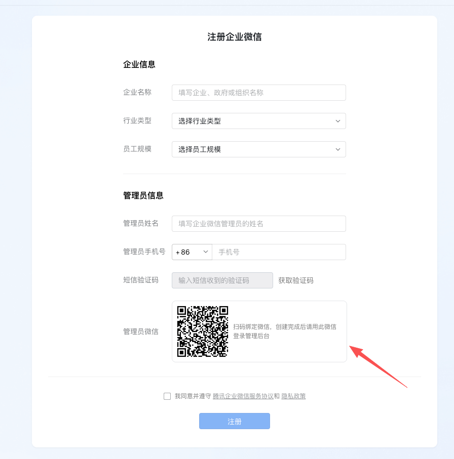
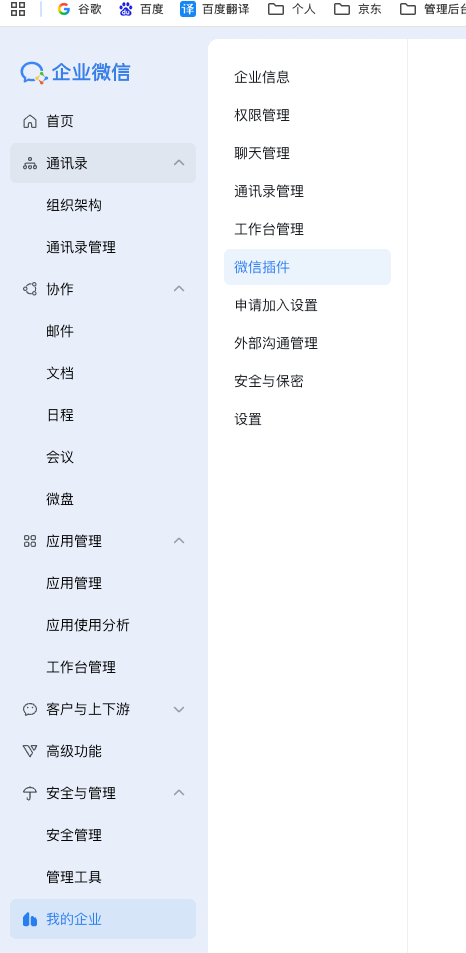
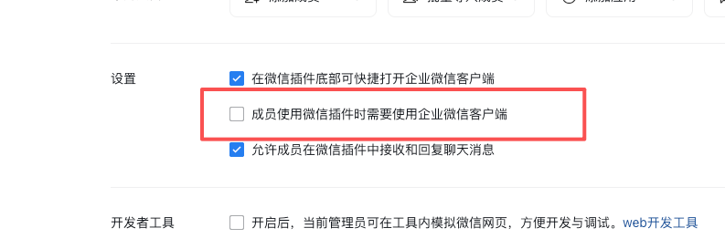
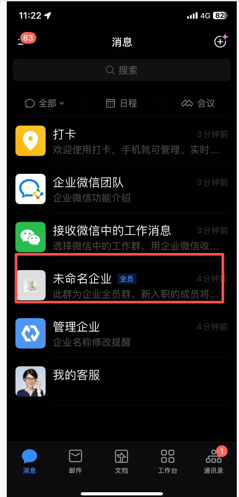
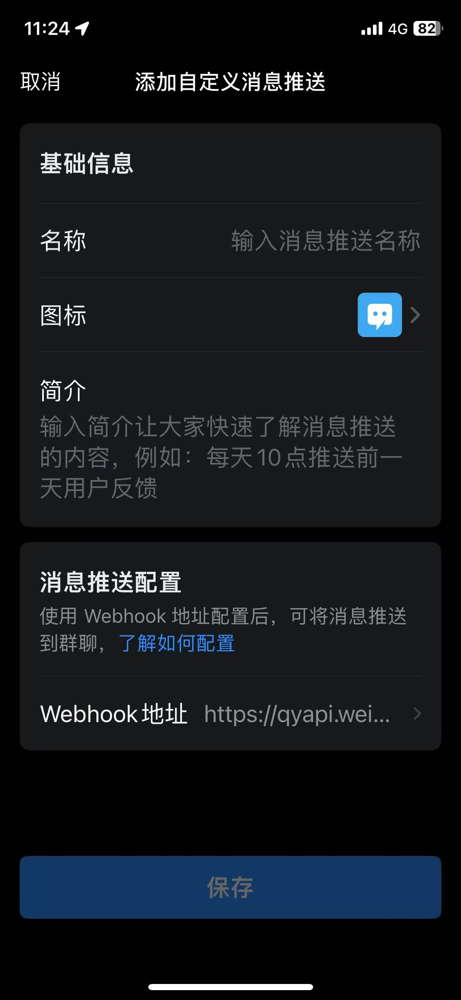

# 企业微信（群机器人 Webhook）

[← 推送渠道总览](../notification-channels.md) · [← README](../../README.md)

首先进入 [企业微信官网](https://work.weixin.qq.com/)，注册企业。

企业名称按照你想要的名称填写就 OK。这里要注意的是，<strong>一定要绑定管理员微信！！</strong>

注册完成后进入管理后台

在这里你可以修改在微信里面接收消息

<strong>注意，这里一定不要勾选，一定不要！</strong>

然后登录企业微信

这里是企业默认的群，然后点击这个群聊，点击右上角...，然后点击消息推送，点击添加

在这里可以添加你自定义的机器人，添加完成后，点击保存，会返回到上一个页面。这个时候就能看看到Webhok地址了。将这个地址复制下来，保存留用。

<strong>注意：官网也说了，这个Webhok地址一定要保密，避免其他人给你推送无用消息。</strong>
